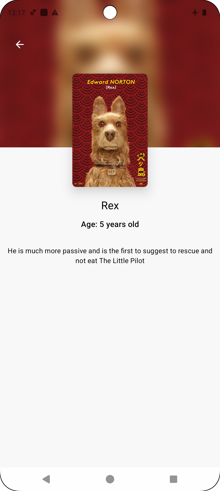
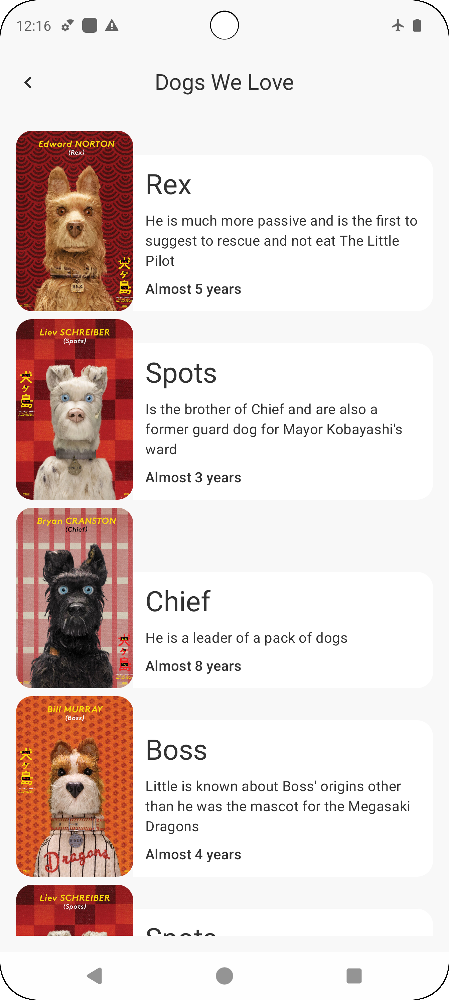

# 🐶 Dog Directory

**Dog Directory** is an Android app built with Jetpack Compose. It fetches a list of dogs from a remote API and stores them locally using Room, allowing offline access.

## ✨ Features

- ✅ Fetches dog data from a remote API  
- ✅ Offline support with local Room database  
- ✅ MVI architecture with clean code principles  
- ✅ Dependency injection with Koin  
- ✅ Modern UI using Jetpack Compose

## 🛠️ Technologies Used

- **Jetpack Compose** – Modern declarative UI  
- **Room** – Local data persistence  
- **Ktor Client** – HTTP networking  
- **MVI Architecture** – State management  
- **Koin** – Dependency injection  
- **Clean Architecture** – Separation of concerns

## ✅ Unit Testing

- **JUnit 5** – Testing framework  
- **MockK** – Mocking library  
- **Turbine** – Testing Kotlin Flows

## 📸 Screenshots

  
  

